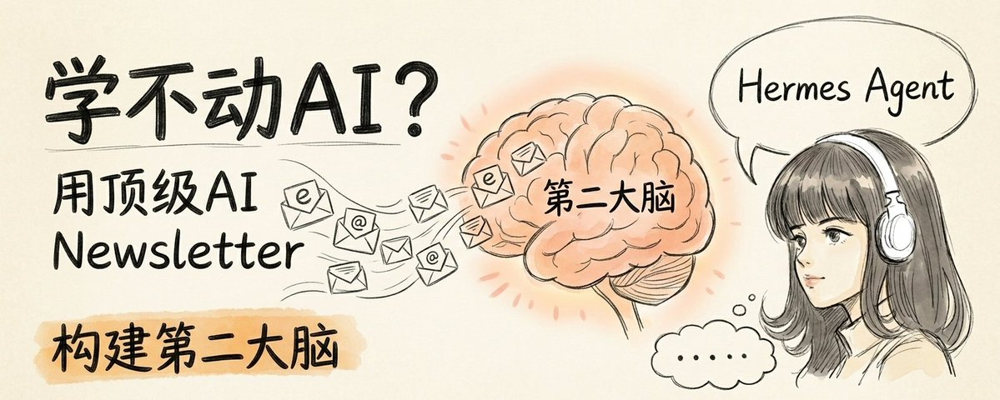

# Hermes Agent工作流：用顶级AI Newsletter构建第二大脑，再也不怕学不动AI（附信息源清单）

- **作者**：铁锤人（lxfater）
- **日期**：2026-04-23
- **来源类型**：X (Twitter) Article 长文
- **原链接**：https://x.com/lxfater/status/2047150392274993624
- **标签**：#AI学习 #第二大脑 #知识管理 #HermesAgent #Newsletter #LLMWiki #Obsidian

---

## 摘要

文章指出学AI的普遍困境：每天刷大量内容但关上手机什么都没进脑子。核心问题是"把劲儿使错了地方"。作者提出用顶级AI Newsletter + Hermes Agent + LLM Wiki（Karpathy方法）构建第二大脑的完整工作流，包括：换信息源、配置Agent邮箱、LLM Wiki拆解知识、倒逼输出三步走。

---

## 核心观点

1. 每天刷AI内容，但关上手机什么都没进脑子
2. 不是不够努力，是大多数人学AI从一开始就"把劲儿使错了地方"
3. 真正有效的是：顶级Newsletter（源头）→ Hermes Agent筛选 → LLM Wiki拆解进知识库 → 倒逼输出

---

## 全文

每天出新东西，你也每天在刷
但关上手机那一刻：什么都没进脑子
刷了那么多，说不出自己学到了啥
AI越来越聪明，你越来越像个局外人
这不是你不够努力，是大多数人学AI，从一开始就把劲儿使错了地方

我有段时间也是这样，直到我把学习方式彻底反过来
把这套方法跑在 Hermes Agent 上之后
学AI这件事，变了，甚至我的文章输出变好了，连续出了18w，17w，86w的文章：

今天，这篇把完整工作流拆给你：

**第一步**：换掉信息源（顶级AI Newsletter清单，从50+里筛出来的）
**第二步**：让 Hermes Agent 每天替你筛选消化，构建第二大脑
**第三步**：倒逼出能打的输出

再也不怕学不动AI！！

---

## 一、换信息源，用Hermes构建获取管道

### 高质量AI Newsletter清单（从50+里筛选）

- **The Rundown AI**（therundown.ai）：每日 AI 产业动态，通俗易懂、密度高
- **TLDR AI**（tldr.tech）：5 分钟科技简报，AI 加编程加产品精华浓缩
- **The Neuron**（theneurondaily.com）：面向非技术读者的 AI 日报，3 分钟读完
- **Ben's Bites**（bensbites.com）：Ben Tossell 的 AI 日报，工具圈消息源
- **Latent Space**（latent.space）：swyx 开发者简报，未公开项目加工程视角
- **Smol AI News**（smol.ai/news）：Discord、Reddit 等 AI 社区圈内直击
- **Interconnects**（interconnects.ai）：Nathan Lambert 的 RLHF、模型训练深度专栏
- **One Useful Thing**（oneusefulthing.org）：Ethan Mollick 的 AI 实用洞察
- **AI Breakfast**（aibreakfast.beehiiv.com）：每周一份 AI 新闻早餐，系统回顾加深度讨论
- **Every**（every.to）：科技与商业的下一步，资深专家战略分析

> 为什么不看国内公众号？AI 这种变化快的赛道，真正有信号的源头全在海外 newsletter。公众号被洗稿一层一层过滤，你看到的时候已经是二手信息。

### 工作流配置步骤

**第一步：给Hermes配置邮箱**
- 使用网易邮箱新出的 Agent 专属邮箱产品 ClawEmail：https://claw.163.com/?channel=lxfater
- 专属激活码：CLAW3C02D3891B6C

**第二步：装 mail-cli，让Hermes有眼睛**
```bash
# 1. 全局安装 mail-cli
npm install -g @clawemail/mail-cli

# 2. 把 API Key 写进系统钥匙串
mail-cli auth apikey set ck_live_xxxxxxxxxxxxxxxx

# 3. 登录主邮箱
mail-cli auth login --user lxfater@claw.163.com

# 4. 测试连接
mail-cli auth test
```

**第三步：构建 newsletter 专属子邮箱**
```bash
mail-cli clawemail create \
  --prefix newsletter \
  --type sub \
  --display-name "Newsletter Bot"
```
然后在 Dashboard 把这个子邮箱的通讯规则打开：开放外部通信，收信范围选所有人。

**第四步：子邮箱订阅newsletter**
以后订阅 newletter 时，订阅框直接填 `XXX.newsletter@claw.163.com`，确认邮件到后让 Hermes 提取确认地址完成订阅。

---

## 二、筛选消化信息，Hermes构建第二大脑

### 第一步：扫 Digest
利用 Agent 初筛一遍 newsletter，既节约时间也不漏热点。ClawEmail 官方自带每天早上发一封今日所有 newsletter 摘要加推荐的日报。

### 第二步：让 LLM Wiki 将newsletter拆进知识库（核心）

**LLM Wiki 是什么**（Karpathy 2026年提出）：
> 它像个实习生，每天你扔一篇文章给它，它把里面的概念、实体、主张、开放问题一个个拆出来，每个做一张索引卡片贴在墙上，再用线把这张新卡片和墙上已有的相关卡片连起来，久了这堵墙就是一张活的知识图。

**具体操作**：
让 Hermes 扫描邮箱里感兴趣的文章，告诉它"这篇编译到我的 Wiki"。跑完之后你会获得一个互相链接的 Markdown 文件，构成知识网络。

**效果**：
- 打开 Obsidian 知识图谱功能，在图里找到不懂的概念，不断问 Hermes 拆解
- 旧概念因为今天这篇又加了一条新论据，新旧概念第一次被连到一起
- 读 1 篇等于刷新 10 篇！别人每天刷 100 条推文一天就忘，你一天一篇自动关联，不易遗忘

---

## 三、用Hermes LLM Wiki倒逼产出

### 方式一：做信息图
Hermes Agent 内置信息图命令行，底层跑的是宝玉的信息图 prompt。把 Wiki index 地址给 AI，问一个概念，它扫里面相关主题的知识，直接吐出信息图。

### 方式二：自己写文章，AI 做脑爆
写的时候碰到想不清楚的地方，对着 Hermes 问：
- 这个概念我上周读过哪几篇支持？
- 那个观点我怎么反驳？
- 还有哪些角度我没考虑到？

让 Hermes 利用 llmwiki 功能给灵感和解决盲点。

---

## 工具与资源

- **ClawEmail（网易邮箱Agent版）**：https://claw.163.com/?channel=lxfater
- **激活码**：CLAW3C02D3891B6C
- **LLM Wiki 教程（铁锤人旧文）**：Obsidian + Claude Code：用 AI 大神 Karpathy 的方法搭一个真正可用的第二大脑
- **自动排版发布Skill**：开源Skill，自动排版发送到公众号草稿

---

## 配图



---

## 关联主题

- AI学习
- 第二大脑
- LLM Wiki
- 知识管理

---

## 来源元数据

- **推文ID**：2047150392274993624
- **作者主页**：https://x.com/lxfater
- **互动数据**：126 赞 / 25 转发 / 7 回复
- **文章浏览**：15.1K Views
- **发布时间**：2026-04-23 03:07 UTC
